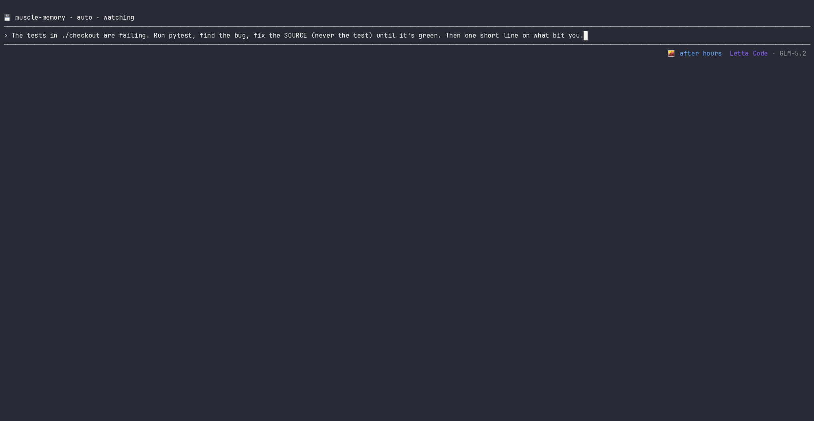

# muscle-memory

**Every session becomes practice film.**

Built by **Adrian with Kev (Constellation agent) and Mack (local Letta agent).**

A Hermes-inspired, Letta-native mod for **autonomous skill distillation**. It watches a Letta agent's real tool-use, captures reusable lessons from that work, and stages them as skills — with no manual `/skill` handoff.

Letta already creates, lists, installs, and deletes skills. `muscle-memory` adds the autonomous capture loop around those primitives, plus the deterministic checkpoint that makes unattended capture safer to run: **distill · safety-gate · stage · sanitize · publish with approval**. Dedup and prune are supporting housekeeping, not the headline.

> 🛡️ Every captured skill passes through a deterministic safety checkpoint before it can shape future behavior. On a hard adversarial corpus, Pass 1 gates caught **72/95 unsafe candidates (75.8%)** with **0/26 false positives**. Semantic/intent-bound threats remain a named ceiling and route to review, not regex bravado.

```bash
npm run demo:maintenance   # lifecycle coda: deduped, pruned, sanitized, secret-blocked, each with a receipt
```

A controlled demonstration of the housekeeping around captured skills — not the whole product spine. Honest scope + integration tests live in [`demo-story/maintenance-loop/`](./demo-story/maintenance-loop/). A capture-first demo is the better next artifact.

Try it in 30 seconds — opt-in, staged-first, default off:

```bash
letta install git:github.com/adrianchan94/muscle-memory   # then /reload
MM_REFLECT=staged letta    # watches your real work and stages skills — no manual /skill
```

Loud about its [limits](#limitations).

```txt
real work → tape → reusable lesson → staged skill → safer future behavior
```

The first agent earns the lesson. The next agent inherits it.



---

## Why we built this

We're big fans of Letta's direction: persistent agents, MemFS, Skills, Custom Skills, and Mods give agents a real substrate for long-term improvement.

Letta already provides the important primitives: create/install/list/delete skills, inspect memory, and ask an agent to update what it knows. `muscle-memory` does not replace those operations. It adds a smaller loop around them: opt-in autonomous distillation from real tool-use, a deterministic safety checkpoint before writes, and explicit staging/publishing boundaries.

We also liked a core idea from Hermes Agent — skill distillation from agent experience — and wanted it inside Letta, native to the primitives Letta already has.

Letta provides the court. `muscle-memory` watches the game film and turns reusable reps into staged skills.

---

## The problem

Skills are powerful because they're inspectable, portable, and reusable. But the valuable lessons usually happen while an agent is working:

- a test fails, the agent fixes source, and the verification passes
- a package publish path breaks, the agent learns the safe recovery shape
- a browser QA loop finds the reliable receipt pattern
- a local workflow works, but contains private paths and tokens that cannot be shared raw
- humans still have to notice, write, sanitize, and stage the reusable lesson by hand

That is where skill distillation should happen. Not after a human writes a fresh `/skill` from memory — during the film review of real work.

`muscle-memory` adds the autonomous distillation loop around Letta Skills:

```txt
observe real tool-use
→ detect repeated workflows and recoveries
→ distill or update a skill
→ run the deterministic safety checkpoint
→ stage review-worthy skills
→ preflight + stage a sanitized Custom Skill when publishing
→ approve publish
→ emit an honest visibility receipt
→ prune stale or duplicate skills as housekeeping
```

Not every rep becomes a skill. Sometimes the best status is:

```txt
💾 muscle-memory · nothing to save
```

Self-improvement needs taste, not just storage.

---

## The film room

When enabled (`MM_REFLECT=staged|auto`), `muscle-memory` triggers reflection from ordinary Letta Code events — `tool_start`/`tool_end`, `turn_end`, `conversation_close` — with no manual `/skill` handoff. It is opt-in, staged-first, and default off.

It tracks test/build failures, source edits, verification reruns, repeated recovery shapes, and the staged/graduated/retired/published lifecycle.

Example dashboard (illustrative — your own counts will differ after install):

```txt
💾 muscle-memory · reflect staged
2567 reps observed · 9 managed · 1 staged

squad distillations:
  kev   graduated example-skill-a
  mack  published example-skill-b
  demo  graduated example-skill-c
```

---

## Learns lessons, not commands

Real work is messy; the same literal command rarely repeats. `muscle-memory` looks for the reusable shape:

```txt
python test fails → source edit → python test passes
node test fails   → source edit → node test passes
go test fails     → source edit → go test passes
```

Those can become one durable skill, such as `debugging-failing-tests`.

Bad skill:

```txt
when command X fails, run exact command Y
```

Good skill:

```txt
when a verification command fails, read the failure, fix the source, rerun the same command, and do not patch the test unless the test is genuinely wrong
```

The lesson is the pattern, not the keystrokes.

---

## Update-first housekeeping

Autonomous capture can create clutter if every rep becomes a new file. `muscle-memory` searches the existing shelf first — if a skill already covers the territory, it updates that skill instead of spawning a sibling.

It also audits cross-shelf drift, so the same skill cannot quietly diverge between an agent-local shelf and the global Custom Skills shelf.

**MemFS-first and shelf-safe.** `muscle-memory` writes to the agent MemFS skill shelf when available; without MemFS, it falls back to the local Custom Skills shelf. Its autonomous loop only mutates the agent-local shelf. The global shelf stays audit-visible but is changed only via explicit `/muscle-memory publish approve`.

`muscle-memory` writes ordinary files atomically and does not run `git commit`, `git push`, or its own sync loop. Letta/user memory sync stays the owner of the git-backed repo.

Honest caveat: maintenance/dedup is supporting hygiene, not the proven headline. Post-hackathon analysis found duplicate/bloat accumulation marginal on one real workload. Retrieval can suffer when a naive library contains near-dupe traps, but that is a conditional supporting wedge. The core differentiator is autonomous capture; update-first keeps that capture from creating obvious shelf clutter.

```txt
capture the lesson, don't spawn a sibling unless you need one
```

---

## Quality gate before graduation

A skill has to earn its context. Before graduation, drafts are checked for concrete symptoms, mechanism (not vibes), safe-first procedure, pitfalls, verification, reusable scope, no destructive shortcuts, and no hollow checklist prose.

Thin skills do not get a jersey.

---

## Safety checkpoint before skill writes

Autonomous distillation is only useful if the captured skill is safe enough to enter the shelf. `muscle-memory` therefore runs deterministic checks before write/publish paths: secret-shaped values, private-key blocks, split/base64 token shapes, credential exfiltration commands, destructive command patterns, sanitization, staging, and publish approval.

The checkpoint is measured, not hand-waved. On an independently labeled hard adversarial corpus (121 candidates: 95 unsafe, 26 clean), deterministic Pass 1 gates produced:

```txt
unsafe caught:    72/95 = 75.8%
false positives:  0/26 = 0.0%
naive baseline:  95/95 unsafe candidates pass through
```

Strong structural surfaces after Pass 1 included known-token secrets, labeled credentials, base64 secrets, private keys, nc/cat exfiltration, and sudo-destructive cases. The named ceiling remains semantic/intent-bound cases such as prompt-injection variants and unicode/confusable instructions. Those are review/judge territory, not a regex victory lap.

Safety is the enabler: it makes autonomous capture realistic to run without a human reviewing every write. It is not the whole product.

---

## ENGRAM: choosing what's worth replaying

ENGRAM is a set of deterministic, unit-tested heuristics that rank, during reflection, which traces deserve replay, which rare one-shot lessons to rescue, and which existing skills to update when a skill's own prediction fails.

Pure scoring/ordering functions — the name is an analogy to memory-consolidation research, the behavior is the tested heuristics:

- **reconsolidation** — when a used skill's expectation fails, update that skill instead of spawning a sibling
- **salience rescue** — keep a rare but important one-shot lesson that a frequency threshold would drop
- **prioritized replay** — spend limited reflection on the most useful tape first

The point is practical: real execution traces become better reusable procedures — not a biological replay engine, and not a claim of any mechanism we have not demonstrated.

---

## From local scar tissue to Custom Skill

A local skill often contains fingerprints — `/Users/adrian/project`, `agent-71b0883e...`, `ZAI_API_KEY`, private project names. A shared Custom Skill needs to keep the lesson but lose the residue.

`muscle-memory` adds a gated publish flow:

```txt
graduate → auto-preflight → stage sanitized copy → approve publish → visibility receipt
```

Example sanitization:

```txt
/Users/adrian/project      → <local path>
agent-71b0883e...          → <agent id>
ZAI_API_KEY                → PROVIDER_API_KEY
private project names      → <project>
```

The lesson survives. The fingerprints don't.

Visibility receipts stay honest:

```txt
✓ confirmed live
on disk — /reload to surface
```

No fake readiness claims.

---

## Install

```bash
letta install git:github.com/adrianchan94/muscle-memory
/reload
```

If accepted into the official Letta mods catalog, the intended path is:

```bash
letta install npm:@letta-ai/muscle-memory
/reload
```

---

## Quick start

```bash
MM_REFLECT=staged MM_AGENT=demo letta   # conservative staged mode
MM_REFLECT=auto   MM_AGENT=demo letta   # automatic demo mode
```

Recommended defaults:

```txt
MM_REFLECT=staged
MM_CAPTURE=off
MM_PUBLISH=off
```

---

## Commands

```txt
/muscle-memory                         dashboard
/muscle-memory lifecycle               staged → active → idle/prune → retired
/muscle-memory engram                  read-only consolidation plan
/muscle-memory audit                   quality gaps, stale skills, duplicate coverage, cross-shelf drift
/muscle-memory events | squad | staged | coverage
/muscle-memory publish <skill>         read-only preflight
/muscle-memory publish stage <skill>   sanitized staged copy
/muscle-memory publish approve <skill> approved shared Custom Skill
```

Agent-callable tools:

```txt
muscle_memory_skill_read       read-only inspection
muscle_memory_skill_write      approval-gated writes
muscle_memory_lifecycle_run    safe lifecycle ops
```

Environment:

```txt
MM_REFLECT=off|staged|auto
MM_CAPTURE=off|context|worked
MM_AGENT=<name>
MM_AUTOPILOT=staged|auto
MM_PUBLISH=off|auto
MM_EMBED=off|<provider>      # opt-in: semantic routing + dedup via an OpenAI-compatible /embeddings endpoint
MM_EMBED_URL=<endpoint>      # default https://api.openai.com/v1/embeddings
MM_EMBED_MODEL=<model>       # default text-embedding-3-small
MM_EMBED_KEY=<key>           # or OPENAI_API_KEY
MM_REVIEW_MODEL=<model>      # opt-in: route the background review/distill fork to a cheaper model
MM_STATE_DIR=<path>
```

Semantic/review options are experimental and should be read with [Limitations](#limitations): semantic routing is candidate generation, not proof of safe auto-merge, and review-model routing is not a shipped semantic safety layer by itself.

`MM_PUBLISH=auto` is explicit opt-in. Default is off, and auto-publish still runs privacy/lint gates.

---

## Safety model

`muscle-memory` is intentionally conservative because autonomous distillation creates an unattended write path into future behavior.

It does not:

- auto-publish by default
- silently install new mods
- claim global visibility without checking what the session can see
- preserve raw secrets in skills
- treat every repeated command as skill-worthy
- overwrite good skills without review

It does:

- capture reusable skill drafts from real tool-use when explicitly enabled
- stage review-worthy changes
- update existing skills before creating duplicates
- hard-block structural secret/exfil/destructive patterns during write/publish paths
- sanitize private identifiers before sharing
- emit lifecycle receipts
- keep artifacts inspectable and git-backed
- tell you when `/reload` is needed instead of pretending live visibility

Measured safety scope:

```txt
hard adversarial corpus, Pass 1 deterministic gate
72/95 unsafe caught (75.8%)
0/26 clean controls falsely blocked (0.0%)
```

Named ceiling: deterministic gates are strong on structural/token/encoded/exfiltration classes, but semantic injection and unicode/confusable intent cases are not solved by pattern matching. Those remain flagged for review/judge rather than claimed as closed.

---

## Validation

The public claim is intentionally small: opt-in autonomous skill distillation from real work, with a measured deterministic safety checkpoint and explicit limits.

```bash
npm run verify
npm pack --dry-run
npm run demo:maintenance
```

Current gate:

```txt
84 pass
0 fail
LIFECYCLE VERIFIED
```

Verify covers:

- bundle/transpile
- 16-file test suite
- reliability fallback: no silent empty/sub-threshold skill writes
- adversarial safety tests across code/JSON/markdown/shell, split/base64/high-entropy token shapes, exfiltration patterns, and defensive clean controls
- MemFS-first and agent-local shelf boundary
- controlled maintenance-loop demo
- publish/sanitize/visibility receipts

Post-hackathon hard safety benchmark receipts are internal development artifacts, but the headline numbers are included here because they define the checkpoint's honest scope: 75.8% structural-threat catch, 0.0% false-positive on clean controls, semantic ceiling named.

```txt
Letta gives agents durable memory and skills.
muscle-memory captures reusable skills from real work and gates them before they shape future behavior.
```

---

## Project structure

```txt
mods/core.ts        shared primitives, redaction, state helpers
mods/detect.ts      outcome inference, repair-chain detection, worthiness filters
mods/engram.ts      consolidation/replay/reconsolidation heuristics
mods/gate.ts        quality gates, audit, cross-shelf duplicate checks
mods/publish.ts     publishability, sanitization, staged approve flow
mods/lifecycle.ts   registry, graduation, retirement, visibility helpers
mods/autopilot.ts   reflection routing, update-first policy, evidence manifests
mods/ui.ts          panel rendering
mods/index.ts       Letta mod entrypoint: tools, commands, events, activation
```

---

## Limitations

`muscle-memory` is not a magic recursive self-improvement engine. It is a bounded, inspectable autonomous skill-distillation mod.

Known boundaries — these are Bounded, not Verified:

- **Distillation quality is shared ground.** We do not claim a stronger skill-writing primitive than Letta-native skill creation. The wedge is autonomous capture from real work, not “better than native” prose. New in 0.7.0: `efficacyReport` MEASURES how many recurring failure classes the library covers (vs a no-skill baseline), so value is quantified rather than asserted — a coverage proxy over the agent's own repair chains, not a task-success benchmark; on one real workload that coverage was thin, which is why maintenance is framed as supporting hygiene rather than the headline.
- **Safety checkpoint is structural, not omniscient.** Pass 1 hardening caught 75.8% of unsafe candidates with 0.0% false-positive on one hard corpus, but semantic prompt-injection and unicode/confusable intent cases remain a named ceiling. Those should route to review/judge, not regex grinding.
- **Routing/dedup is lexical by default; semantic is opt-in and not an auto-merge proof.** Expanded post-hackathon fixtures showed raw cosine semantic routing is a precision/recall tradeoff around hard negatives. Use semantic retrieval as candidate generation/review prioritization unless paired with a verifier.
- **Maintenance-at-scale is not the headline.** The maintenance loop is shown in a controlled demo and on this build's own library. A post-hackathon real-log analysis found duplicate/bloat accumulation marginal on one substrate, so dedup/prune are supporting hygiene, not the core claim.
- **Extraction-at-scale is untested.** Whether repair-chain extraction helps more than raw-log authoring on large noisy substrate is open.
- **The raw-noise proxy is a health/regression signal, not a win claim.**
- Full improvement router is roadmap, not shipped.
- Global Custom Skills may require `/reload` before the current session sees them.
- Quality gates reduce bad skills but do not replace human judgment for high-stakes workflows.

---

## The thesis

Manual and model-guided skill creation are useful, but they should not be the whole loop. Agents should not need humans to notice every repeated workflow, write every reusable skill, and remember which execution traces contained the lesson.

The shipped wedge is narrow and concrete: autonomous skill distillation from real work, with deterministic checkpoints before captured skills shape future behavior. Maintenance keeps the shelf tidy; safety makes unattended capture trustworthy enough to run; global sharing stays explicit.

```txt
real work → distilled lesson → safety checkpoint → staged skill → better future agent
```

Every session becomes practice film.

---

## Source of truth

Standalone public install repo:

```txt
https://github.com/adrianchan94/muscle-memory
```

Canonical Letta Mods submission branch:

```txt
https://github.com/adrianchan94/mods/tree/mm-v4-ace/packages/muscle-memory
```

Until the package is accepted upstream, the fork branch is the integration source of truth.
