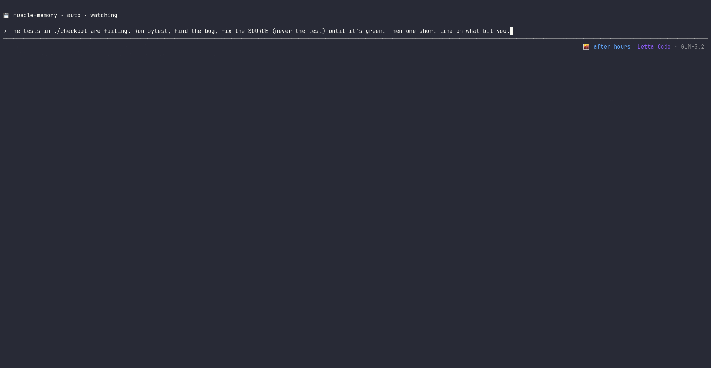

# Muscle Memory V1

**Verifier-gated procedural memory for Letta agents.** It watches real work, distils the smallest reusable procedure into a skill, prescribes exactly one skill — or abstains — when you hit a gap, then records whether that intervention helped, harmed, or changed nothing.

Your agent has a skill shelf. Over time it becomes a storage unit:

- useful workflows stay buried in chat history
- repeated mistakes keep repeating
- duplicate skills pile up, and stale ones stay on the shelf long after they stopped being correct

The usual fix makes it worse — inject more context, hope the model reads it. **Muscle Memory is not that.** It is not a vector store, not top-k retrieval, and not a bigger prompt:

| | Muscle Memory | Retrieval-style memory |
|---|---|---|
| At task time | **one** installed skill, or `ABSTAIN` | top-k passages, or everything relevant |
| Trigger | you attest an observed gap | similarity score |
| After the task | the next action is recorded as helped / harmed / neutral | nothing |

Relevance is not an indication. If you already know the recovery, it tells you to work unaided.

## What it looks like in use

Real tool output, trimmed for width:

```txt
› muscle_memory_prescribe(
    task: "An exact-match edit failed because the target text is stale.",
    gap_observed: true )

  PRESCRIBE "recovering-failed-exact-match-edits" — one smallest matching installed skill
  NEXT · invoke the normal Skill tool, perform the task, then call muscle_memory_close
         with the observed result
  gap diagnosis: caller-attested observed/known procedure gap; the router does not infer
         hidden model capability
  control: do not inject sibling skills or the full shelf

› Skill(skill: "recovering-failed-exact-match-edits")     … the agent does the work …

› muscle_memory_close(
    possession_id: "<id>", result: "helped",
    reason: "The re-anchor procedure resolved the failed edit and the original check passed." )

  OUTCOME RECORDED · helped · agent-judged
  SKILL · recovering-failed-exact-match-edits
  EVIDENCE · 1 judged · 0 verified · still unproven
```

Call it without a real gap and it refuses:

```txt
  ABSTAIN — no observed/known procedure gap was declared. Relevance alone is not an
  indication; let the model work unaided.
```

That closed possession is the whole point: one skill helped once now reads `EARLY POSITIVE · NEEDS REPLICATION` on the roster — not "promoted". Nothing is promoted or retired on one result.

## What the evidence actually says

This is the Decision Report from one seat running Muscle Memory today — the product's own render, real counts, with only the live `LAST` and `PENDING` lines trimmed:

```txt
MUSCLE MEMORY · DECISION REPORT · EARLY EVIDENCE
INTERVENTIONS · 5 served · 5 helped · 0 harmed
ABSTENTIONS · 20 · 19 succeeded unaided · 1 failed
SKILLS · 18 active · 0 proven
STATUS · early judged evidence · 0 verified · not claim-bearing
```

Read it exactly as the last line reads it. This is **early judged evidence from one live seat** — one agent, one operator, one workload, judged by agent and human, not by an instrument. It is not a benchmark, not replicated, and not claim-bearing. `0 proven` is not a gap in the tape; `proven` requires instrument-owned verification, and these possessions did not carry it.

Two things are worth noticing anyway: **`harmed` is a first-class outcome that this system will print about itself**, and it abstained four times as often as it intervened.

The design comes from a bounded research program. **Muscle Memory V1 is the product; [Knowing Is Not Doing: Measuring Execution-Time Governance of Learned Skills in LLM Agents](https://muscle-memory-v1-research.vercel.app/) is the canonical research record behind its design.** It demonstrates bounded effects in tested tool-use tasks. It does **not** establish universal model behaviour or external replication.

## Install (30 seconds)

```bash
letta install git:github.com/adrianchan94/muscle-memory
/reload
```

That is the whole install. A fresh agent then sees **three tools** — `muscle_memory_prescribe`, `muscle_memory_close`, and a bounded read — and an idle status line, `💾 muscle-memory · N skills · H helped`. Mutation, lifecycle, ratings, verification, and diagnostics stay hidden until you set `MM_ADVANCED=on`. The memory system should not eat the context it is trying to improve.

The npm identity is **`@adrianchan94/muscle-memory`**, but it is **not published**; this is a release candidate. See the [RC3 release notes](./docs/RELEASE-NOTES-v1.0.0-rc.3.md) and [cold-review kit](./docs/cold-review/README.md) for the gates.

[Research record](https://muscle-memory-v1-research.vercel.app/) · [RC3 release notes](./docs/RELEASE-NOTES-v1.0.0-rc.3.md) · [Agent guide](./MOD.md) · [Provenance](#source-ownership-and-lineage) · [Security](./SECURITY.md) · [Contributing](./CONTRIBUTING.md)



<sub>Demo GIF is a repository review artifact and is excluded from the packed release.</sub>

## What ships in V1

| Product move | What it does | Why it exists |
|---|---|---|
| **One skill or abstain** | `muscle_memory_prescribe(task, gap_observed)` returns one installed procedure or `ABSTAIN`; it never dumps the shelf. | Research found that skill value depends on model × task × knowledge gap. Broad injection is not a neutral default. |
| **Possessions and honest closeout** | Every decision opens a resumable possession; closeout records `helped`, `harmed`, `neutral`, `succeeded_unaided`, or `failed_unaided`. | Retrieval is not application. The unit of learning is the next observed action, not a citation. |
| **Evidence-aware roster** | Judged outcomes, field ratings, and verified evidence stay separate; advice requires repeated minutes and lifecycle changes are never automatic. | A skill can sound right, be followed faithfully, and still hurt. The referee must be allowed to call red. |
| **Instrument-owned verification** | The first adapter binds a pre-work manifest to one regular file and derives the exact SHA-256 outcome itself. | Callers cannot self-award `verified`; proof must match the claim's shape. |
| **Update-first learning** | Existing and staged skills are searched before a new sibling can be created; n=1 and retired-clone gates resist shelf bloat. | A learning system that only appends becomes a markdown junk drawer. |
| **Staged, reversible lifecycle** | Draft → quality gate → graduate → review → retire/restore; pinned skills are protected and sharing is explicit. | Learning needs rollback, refusal, and custody—not irreversible accumulation. |
| **History and compaction learning** | Watermarked history mining replays old tool traces through the same pipeline; opt-in compaction reflection runs before evidence is evicted. | Useful film exists before installation and immediately before forgetting. |
| **Squad shelf and catalog bridge** | Sanitized skills can transfer staged-first across agents; graduated local skills can sync reversibly into Desktop without copying receipts or symlinks. | The first agent can earn the lesson without silently overwriting another agent's active shelf. |
| **Privacy and security gates** | Secret-shaped values hard-block writes/shares; identifiers and machine paths are sanitized; support files are scanned. | Reusable procedures should keep the mechanism and lose the operator residue. |
| **Lean by default** | Fresh agents see three tools—prescribe, close, and bounded read. Research, mutation, lifecycle, and verification controls require `MM_ADVANCED=on`. | The memory system should not consume the context it is trying to improve. |

## The V1 causal loop

```text
real work
  ↓
experience tape ──→ repeated gap or verified recovery
  ↓
update an existing skill first; create only with repeated class-level evidence
  ↓
security + formulation gates ──→ staged / graduated / retired (reversible)
  ↓
one task-time prescription or ABSTAIN
  ↓
normal Skill invocation → task execution
  ↓
agent/human judgment OR qualified instrument-owned verification
  ↓
helped / harmed / neutral + evidence tier
  ↓
keep · revise · bench · retire
```

## Research, with boundaries

**Knowing is not doing.** The V1 research program demonstrates, in bounded tool-use tasks, that authored or retrieved procedural knowledge can fail to govern execution; that bad shelf guidance can also be followed; and that act-time governance can change measured behavior. It does **not** establish a universal law of model cognition or externally reproduced efficacy.

**Muscle Memory V1 is the product. [Knowing Is Not Doing: Measuring Execution-Time Governance of Learned Skills in LLM Agents](https://muscle-memory-v1-research.vercel.app/) is the canonical research record behind its design.** Human, agent-readable, structured, and paper surfaces reconcile to one public presentation manifest; that proves presentation integrity, not independent reproduction of the underlying experiments.

`1.0.0-rc.2` remains the qualified historical reference candidate. The current owner candidate changes package identity, documentation, verification, and release plumbing, so it requires a fresh exact-byte seal, cold review, and custody before it can become final `1.0.0`.

Built and maintained by **Adrian Chan · [@adrianchan94](https://github.com/adrianchan94)** with **Kev** and **Mack** as agent collaborators. Mack's review is role-separated within the same project, not external replication.

---

## Why we built this

We're big fans of Letta's direction: persistent agents, MemFS, Skills, Custom Skills, and Mods give agents a real substrate for long-term improvement.

Letta already provides the important primitives: create/install/list/delete skills, inspect memory, and ask an agent to update what it knows. `muscle-memory` does not replace those operations. It adds a smaller layer around them: deterministic, opt-in skill-shelf maintenance that can dedup, gate, sanitize, prune, and keep global sharing explicit.

We also liked a core idea from Hermes Agent — skill distillation from agent experience — and wanted it inside Letta, native to the primitives Letta already has.

Letta provides the court. `muscle-memory` watches the game film.

## The research built V1

Muscle Memory was not feature-complete first and benchmarked afterward. The research program selected the architecture.

We tested whether agents could turn experience into useful procedural memory, preserved the failed and blocked runs, isolated why apparently faithful memories could still underperform, repeated the result on a fresh corpus, and then made every substantial finding answer one product question:

> **What did the evidence force V1 to become?**

### Four findings that became product decisions

| Finding | Measured interruption | What V1 implements | Receipt boundary |
|---|---|---|---|
| **1 · Skills are prescription drugs for agents.** Skill value emerges from model × task × knowledge gap; relevance alone is not an indication. | The same intervention class moved from **−0.14** where the model already knew the procedure to **+1.00** where it was genuinely underivable. | Update-first MemFS routing and coverage diagnosis govern learning; task-time `prescribe` requires the caller to attest an observed/known procedure gap, then returns exactly one installed skill or **ABSTAIN**—never the full shelf. Same-model negative field evidence forces abstention. | `Skill League Q1 · f8ba5f5f…4005` / `Combine V5 · 32cd2091…7051` |
| **2 · A learned skill can be faithful and still unusable.** Render form is part of learning. | The same verified procedure scored **0.6 as prose → 5.4 with one deterministic worked example**—same tasks, graders, route, and underlying lesson. | `MM_CAPTURE` preserves redacted symptom→fix worked examples; deterministic generation carries concrete execution-shaped examples into class-level skills; graduation rejects procedural drafts with no fenced example. Fidelity and formulation are separate gates. | `PRISM-RENDER-AB · e7caa4fd…0bb` |
| **3 · Grade learning against a ceiling, not a vibe.** | Autonomous learning captured **87.86%** of exact teaching in Q2.1 and **88.04% [74.18%, 98.96%]** on a fresh non-overlapping corpus in the same requested Sol family. Fresh REP1 admitted **37/40** skills, improved **19/20** worlds, cleared **16/16** gates, and recorded **zero measured harms**. | Exact deterministic memory remains the production spine; autonomous distillation is a qualified assist. Every write path runs admission gates and emits inspectable evidence rather than treating generation as proof. | `Q2.1 · 6593224f…f09` / `FRESH REP1 · 7bbf4bbf…eb9a` / `Mack custody · a96ad914…e3cf` |
| **4 · The bars must be allowed to refuse a win.** | Q1 posted **+3.20** with every world positive and was still refused: capture was **66.32% < 75%**, and the frozen concentration requirement also missed. | Staged-by-default writes, graduation truth, reversible retire/restore, pin protection, stale-skill pruning, and a field referee whose reasoned outcomes become visible roster recommendations—without automatic promotion or retirement. | `COMPOUND-M2-Q1 · 18571dcb…605f` |

The conclusion is not “store more.” It is:

```txt
observe a real miss
→ distill the smallest underivable lesson
→ verify it
→ render it so the model can execute it
→ route it only to the matching gap
→ measure the next possession
→ update, bench, or retire it
```

**Context is treatment, not nutrition. Skills must earn their minutes.** The prescription language is a model for intervention discipline—not a biological or clinical claim.

### One research account, legible to humans and agents

V1 is accompanied by a dual-audience research experience generated from the same canonical content. Humans and agents do not receive different truths; they receive different renderings of the same claims, limitations, experiments, and receipt boundaries.

**Human-readable surfaces**

- [Knowing Is Not Doing — live V1 research ledger](https://muscle-memory-v1-research.vercel.app/) — claims + receipts; product name remains Muscle Memory (`sendAuthorized: false`)
- [Legacy alias (temporary)](https://muscle-memory-story.vercel.app/) — same current production deploy; keep bookmarks working while the research alias is canonical
- [July historical research site](https://muscle-memory-story-5bueq8t1n-adrianchan94s-projects.vercel.app/) — Phase-0 / (H) precursor substrate; not the live claim ceiling
- [Public research paper](https://muscle-memory-v1-research.vercel.app/muscle-memory-public-research-edition.pdf) — a dedicated report generated from the canonical research record, not a printout of the website

**Agent-readable surfaces**

- [Agent Reading Room](https://muscle-memory-v1-research.vercel.app/agent-reading-room.md) — reflective orientation with the earned and refused claims kept together
- [`llms.txt`](https://muscle-memory-v1-research.vercel.app/llms.txt) — complete narrative account
- [`mm-research.json`](https://muscle-memory-v1-research.vercel.app/mm-research.json) — structured experiments, findings, limits, references, and receipt anchors
- [`mm-research.schema.json`](https://muscle-memory-v1-research.vercel.app/mm-research.schema.json) — machine-checkable contract
- [`research-manifest.json`](https://muscle-memory-v1-research.vercel.app/research-manifest.json) — integrity hashes for the public presentation artifacts

The public manifest proves that the human narrative, agent digest, structured dataset, schema, and paper reconcile to one presentation account. It does **not** claim that public presentation integrity independently reproduces the underlying experiments; complete frozen inputs, raw outcomes, invocation records, and custody chains remain controlled reviewer artifacts.

### Lineage, not mythology

Muscle Memory integrates inherited ideas rather than pretending each component appeared from nowhere:

- **Letta** supplies persistent agents, MemFS, Skills, Custom Skills, Mods, and the runtime court this lifecycle operates on.
- **Anthropic's [Agent Skills](https://www.anthropic.com/news/skills) open standard** supplies the portable `SKILL.md` artifact shape used across the ecosystem.
- **Hermes Agent** helped inspire experience-to-skill distillation.
- **Soar chunking** established the procedural-learning shape decades earlier: resolved impasses can compile into reusable production rules ([Laird, Rosenbloom & Newell, 1986](https://doi.org/10.1007/BF00116249)).
- **Adaptive retrieval** showed at fact level that external context is most useful where parametric knowledge is missing ([Mallen et al., 2023](https://doi.org/10.18653/v1/2023.acl-long.546)); Muscle Memory tests the analogous matchup law for procedures.
- **CONSORT-AI** contributes the trial-reporting discipline behind frozen protocols, controls, amendments, and refused claims ([Liu et al., 2020](https://www.nature.com/articles/s41591-020-1034-x)).

The earned contribution is the integration: an exam-qualified gatekeeper, ceiling-relative learning metric, single-variable render repair, task-conditioned routing, refusal custody, outcome-governed lifecycle, and separate product-byte qualification in one closed loop.

### How this differs from adjacent approaches

Muscle Memory does **not** claim a new memory store, reflection primitive, retriever, verifier, or skill-library concept. Prior work established each of those pieces. This package focuses on the control loop around them:

| Control | Muscle Memory | Common baseline |
|---|---|---|
| Admission | Candidate evidence + fail-closed verifier | Write or import directly |
| Maintenance | Update an existing skill before creating a sibling | Append another artifact |
| Deployment | Task-conditioned route **or abstain** | Broad or top-k injection |
| Follow-up | Reasoned post-use attribution | Task success alone |
| Governance | Reversible retain / revise / retire states | Unbounded accumulation |
| Custody | Frozen gates and receipt-bound outcomes | Demo or aggregate benchmark |

The accompanying research account positions the loop against Generative Agents, MemGPT, Reflexion, Voyager, ExpeL, Agent Workflow Memory, MemP, SkillsVote, Library Drift/Ratchet, and the concurrent 2026 verified-skills wave. Its strongest claim is compositional and experimental: qualify the gatekeeper, measure autonomous learning against an exact-memory ceiling, preserve blocked and negative results, repair one mechanism at a time, and make product bytes earn a separate pass.

> **Release boundary:** this repository currently contains a release candidate, not a production-readiness claim. Research results and prior-bundle product gates do not automatically qualify the exact packed release candidate.

---

## The problem

Skills are powerful because they're inspectable, portable, and reusable. But over time a skill shelf can turn into a storage unit:

- useful workflows stay buried in chat history
- repeated mistakes keep repeating
- duplicate skills pile up
- local scar tissue is too private to share
- stale skills keep pretending they still know ball
- humans end up manually writing, merging, sanitizing, and pruning everything

That's not a learning loop. That's a junk drawer with markdown.

`muscle-memory` adds **Skill Ops**: the lifecycle around learned skills.

```txt
observe real tool-use
→ detect repeated workflows and recoveries
→ distill or update a skill
→ quality-gate the draft
→ graduate useful skills
→ preflight + stage a sanitized Custom Skill
→ approve publish
→ emit an honest visibility receipt
→ prune stale or duplicate skills
```

Not every rep becomes a skill. Sometimes the best status is:

```txt
💾 muscle-memory · nothing to save
```

Self-improvement needs taste, not just storage.

---

## The film room

When enabled (`MM_REFLECT=staged|auto`), `muscle-memory` triggers reflection from ordinary Letta Code events — `tool_start`/`tool_end`, `turn_end`, `conversation_close` — with no manual `/skill` handoff. It is opt-in, staged-first, and default off.

It tracks test/build failures, source edits, verification reruns, repeated recovery shapes, and the staged/graduated/retired/published lifecycle.

Example dashboard (illustrative — your own counts will differ after install):

```txt
💾 muscle-memory · reflect staged
<reps> reps observed · 9 managed · 1 staged

squad distillations:
  agent-a  graduated example-skill-a
  agent-b  published example-skill-b
  agent-c  graduated example-skill-c
```

---

## Learns lessons, not commands

Real work is messy; the same literal command rarely repeats. `muscle-memory` looks for the reusable shape:

```txt
python test fails → source edit → python test passes
node test fails   → source edit → node test passes
go test fails     → source edit → go test passes
```

Those can become one durable skill, such as `debugging-failing-tests`.

Bad skill:

```txt
when command X fails, run exact command Y
```

Good skill:

```txt
when a verification command fails, read the failure, fix the source, rerun the same command, and do not patch the test unless the test is genuinely wrong
```

The lesson is the pattern, not the keystrokes.

---

## Update-first, because skill bloat is real

Most generators create first and ask questions later. `muscle-memory` searches the existing shelf first — if a skill already covers the territory, it updates that skill instead of spawning a sibling.

It also audits cross-shelf drift, so the same skill cannot quietly diverge between an agent-local shelf and the global Custom Skills shelf.

**MemFS-first and shelf-safe.** `muscle-memory` writes to the agent MemFS skill shelf when available; without MemFS, it falls back to the local Custom Skills shelf. Its autonomous loop only mutates the agent-local shelf. The global shelf stays audit-visible but is changed only via explicit `/muscle-memory publish approve`.

`muscle-memory` writes ordinary files atomically and does not run `git commit`, `git push`, or its own sync loop. Letta/user memory sync stays the owner of the git-backed repo.

Honest caveat: routing is lexical-precision-first, with an opt-in semantic recall lane (`MM_NATIVE=passages`) whose duplicate-suspect trust is canary-calibrated (see CHANGELOG). Live decision quality on the 16-case labeled set: lexical-only 7/16 → hybrid 15/16 across three consecutive Letta Cloud runs; the one standing miss is an embedding-model limit, receipt in the bench. Semantic evidence never auto-patches — it only corroborates or parks.

```txt
improve the library, don't grow a landfill
```

### Prescribe one—or abstain

A relevant skill is not automatically useful. For the current task, call the dedicated `muscle_memory_prescribe` tool with a concrete `task` and `gap_observed:true` only as a caller attestation after an observed miss or a known missing procedure. V1 does not pretend it can inspect a model's hidden parametric knowledge; it exposes the current runtime model, conditions on same-model field evidence when available, and labels an untested model/skill pairing as unproven. The legacy `muscle_memory_skill_read(action: "prescribe", ...)` route remains compatible. The same contract is available to humans as:

```txt
/muscle-memory prescribe --gap <task description>
```

The result is deliberately narrow:

- **PRESCRIBE one installed skill** when one candidate clears the strict distinctive-match and dominance bars;
- **ABSTAIN** when no observed/known gap was attested, no skill safely matches, or the match is ambiguous;
- never inject the full shelf, never prescribe several siblings, and never manufacture a new skill during task-time selection.

That is the bounded V1 product form of the research result: caller-owned diagnosis first, smallest dose, no context tax when no gap is known. Task-time matching is deliberately conservative lexical evidence (distinctive-term floor + dominance), not a claim that V1 can measure hidden model knowledge or use an uncalibrated embedding score as a relevance oracle.

### Bound exact-file verification

Ordinary closeouts remain explicitly `human_judged` or `agent_judged`. With `MM_ADVANCED=on`, one narrow machine-checkable task class also gets an instrument-owned exact-file SHA-256 adapter:

1. Configure an absolute trusted workspace root with `MM_EXACT_FILE_ROOT`.
2. Before work begins, call `register_exact_file_verification` with a unique task ID, matching task class, root-relative target path, and expected final SHA-256. It writes a create-once read-only manifest.
3. Use the advanced `muscle_memory_skill_read(action: "prescribe", ..., verification_task_id: "<id>")` path; the immutable manifest hash is bound into the possession decision. The lightweight `muscle_memory_prescribe` tool intentionally omits advanced verification metadata.
4. After the work, call `verify_agent_possession` with **only** `possession_id`. The adapter resolves the trusted root, re-hashes the manifest, rejects traversal/symlinks/replay, hashes the opened file descriptor, derives `helped` or `harmed`, and appends the instrument-owned receipt.

The generic `record_agent_possession` tool still cannot accept `verified`. Callers define the expected artifact before the possession; they cannot self-award the result, tier, path, hash, or receipt after seeing the work. The adapter fails closed on platforms without `O_NOFOLLOW`. It verifies exact file bytes only—it does not prove semantic correctness, causal skill impact, or unaided abstention quality.

---

## The Decision Report

The **Decision Report** is the agent-facing box score. Muscle Memory does not infer that a skill helped merely because it was retrieved; task-time use is tracked as a bounded possession:

1. `muscle_memory_prescribe` records one prescription or abstention after a caller-attested gap.
2. A prescription becomes real use only when the normal `Skill` tool invokes the exact skill.
3. `muscle_memory_close` closes the same possession with a lightweight agent-judged outcome; the advanced `record_agent_possession` surface remains for human judgment, evidence references, and append-only corrections; a bound instrument closes the narrow task classes it can verify itself.
4. `muscle_memory_skill_read(action: "report")` keeps interventions, smart restraint, pending work, verified evidence, and judged evidence explicit.

The optional `rate_skill` referee records a separate associative field rating (`up`, `down`, or reasoned `no_rate`) from observed experience:

- `up` / `down` maintain the backward-compatible **plus-minus** aggregate;
- every accepted rating first lands in an append-only reason sidecar with rater, runtime model, task, and optional evidence reference;
- `no_rate` records neutral tape without manufacturing a score;
- a failed sidecar write is reported as **not recorded**; a failed aggregate write is **partial**;
- plus-minus is film-room evidence, not causal proof, and never auto-promotes or auto-retires a skill.

`/muscle-memory roster` is the rotation-and-bench review. It includes both Muscle Memory-managed skills and installed-shelf skills that actually entered a possession, so a useful intervention never disappears at the next screen. Possession outcomes and judged/verified evidence are shown separately from field plus-minus ratings. The lean agent read hides zero-signal rows behind one explicit count; the human slash command and advanced agent surface keep the complete rotation. Its agent-facing output stays precise—`EARLY POSITIVE · NEEDS REPLICATION`, `PROMOTION REVIEW`, `RETIREMENT REVIEW`, `HOLD · INSUFFICIENT EVIDENCE`, and `UNPROVEN · NEEDS OUTCOMES`—and still requires at least three rated tasks before recommending a roster move.

```txt
/muscle-memory rate systematic-debugging up fixed the next failure without another patch loop
/muscle-memory roster
```

---

## Quality gate before graduation

A skill has to earn its context. Before graduation, drafts are checked for concrete symptoms, mechanism (not vibes), safe-first procedure, pitfalls, verification, reusable scope, no destructive shortcuts, and no hollow checklist prose. A procedural skill needs a fenced example containing a real command, file, code fragment, or diff; generic `write → read → verify` arrows do not clear the bar. This is a formulation gate—not a claim that arbitrary snippets were executed by the verifier.

Thin skills do not get a jersey.

---

## ENGRAM: choosing what's worth replaying

ENGRAM is a set of deterministic, unit-tested heuristics that rank, during reflection, which traces deserve replay, which rare one-shot lessons to rescue, and which existing skills to update when a skill's own prediction fails.

Pure scoring/ordering functions — the name is an analogy to memory-consolidation research, the behavior is the tested heuristics:

- **reconsolidation** — when a used skill's expectation fails, update that skill instead of spawning a sibling
- **salience rescue** — keep a rare but important one-shot lesson that a frequency threshold would drop
- **prioritized replay** — spend limited reflection on the most useful tape first

The point is practical: real execution traces become better reusable procedures — not a biological replay engine, and not a claim of any mechanism we have not demonstrated.

---

## From local scar tissue to Custom Skill

A local skill often contains fingerprints — `/Users/adrian/project`, `agent-71b0883e...`, `ZAI_API_KEY`, private project names. A shared Custom Skill needs to keep the lesson but lose the residue.

`muscle-memory` adds a gated publish flow:

```txt
graduate → auto-preflight → stage sanitized copy → approve publish → visibility receipt
```

Example sanitization:

```txt
/Users/adrian/project      → <local path>
agent-71b0883e...          → <agent id>
ZAI_API_KEY                → PROVIDER_API_KEY
private project names      → <project>
```

The lesson survives. The fingerprints don't.

Visibility receipts stay honest:

```txt
✓ confirmed live
on disk — /reload to surface
```

No fake readiness claims.

---

## Install

Primary path is the author-owned repo. npm publication of `@adrianchan94/muscle-memory` remains separately gated and is **not** authorized by this branch.

```bash
letta install git:github.com/adrianchan94/muscle-memory
/reload
```

When/if an npm release is explicitly approved later:

```bash
letta install npm:@adrianchan94/muscle-memory
/reload
```

Historical Letta-scope package names are custody lineage only — do not treat them as the current owner identity.

---

## Quick start

```bash
MM_REFLECT=staged MM_AGENT=demo letta   # conservative staged mode
MM_REFLECT=auto   MM_AGENT=demo letta   # automatic demo mode
```

Recommended defaults:

```txt
MM_REFLECT=staged
MM_CAPTURE=off      # max privacy; structural worked examples still render
MM_PUBLISH=off
```

Even with `MM_CAPTURE=off`, repair skills render a bounded structural worked example from the observed command/fix class. `context` adds redacted real error symptoms; `worked` adds redacted fix diffs. This keeps the Prism result—concrete worked-example formulation matters—without pretending arbitrary snippets were runtime-executed or forcing raw work content into storage.

---

## Commands

```txt
/muscle-memory                         private Decision Report
/muscle-memory prescribe --gap <task> one installed skill or ABSTAIN
/muscle-memory ratings                 next-possession plus-minus tape
/muscle-memory roster                  rotation-and-bench Skill Review from observed outcomes
/muscle-memory lifecycle               staged → active → idle/prune → retired
/muscle-memory engram                  read-only consolidation plan
/muscle-memory audit                   quality gaps, stale skills, duplicate coverage, cross-shelf drift
/muscle-memory events | squad | staged | coverage
/muscle-memory publish <skill>         read-only preflight
/muscle-memory publish stage <skill>   sanitized staged copy
/muscle-memory publish approve <skill> approved shared Custom Skill
/muscle-memory mine [agent-id]         retroactive mining: distill from history the mod never saw (read-only, watermarked)
/muscle-memory rate <skill> up|down|no_rate [reason...]  field rating → reason ledger + plus-minus tape
/muscle-memory shelf publish <skill>   publish the SANITIZED staged copy to the shared squad shelf archive
/muscle-memory shelf attach            attach the squad shelf to this agent
/muscle-memory shelf pull <skill>      pull a squad skill → STAGED for review (never the active shelf)
```

Default agent-callable surface — one possession, no research-console tax:

```txt
muscle_memory_prescribe   two-field task route: one installed skill or ABSTAIN
muscle_memory_close       three-field agent-judged same-possession closeout
muscle_memory_skill_read  Decision Report, pending work, Skill Review, or one known skill
```

Set `MM_ADVANCED=on` to expose the full agent research/maintenance surface:

```txt
record_agent_possession           human judgment, evidence references, and corrections
register_exact_file_verification  immutable pre-work exact-file task manifest
verify_agent_possession           instrument-owned exact-file closeout; possession_id only
muscle_memory_skill_write         approval-gated writes
muscle_memory_lifecycle_run       safe lifecycle ops
rate_skill                        next-possession up/down/no_rate field rating + plus-minus tape
muscle_memory_skill_read          adds reflection planning, Coverage, share cards, registry, and diagnostics
```

Human `/muscle-memory ...` commands remain available in both modes. Advanced machinery is hidden from the default agent tool schema, not deleted.

Environment:

```txt
MM_ADVANCED=off|on  # default off: expose only prescribe, close, and lean read
MM_REFLECT=off|staged|auto
MM_CAPTURE=off|context|worked
MM_AGENT=<name>
MM_PRIVATE_IDENTIFIERS=<comma-separated private agent labels>
MM_GUARD=off|ask|deny
MM_REFLEX=off|on
MM_AUTOPILOT=staged|auto
MM_PUBLISH=off|auto
MM_STATE_DIR=<path>
MM_EXACT_FILE_ROOT=<absolute trusted workspace root>
MM_MESH_FEED=<shared path>  # optional override when agents use isolated state roots
```

`MM_PUBLISH=auto` is explicit opt-in. Default is off, and auto-publish still runs privacy/lint gates.

---

## Safety model

`muscle-memory` is intentionally conservative.

It does not:

- auto-publish by default
- silently install new mods
- claim global visibility without checking what the session can see
- preserve raw secrets in skills
- treat every repeated command as skill-worthy
- overwrite good skills without review

It does:

- stage review-worthy changes
- update existing skills before creating duplicates
- hard-block secret-shaped values during publishing
- sanitize private identifiers before sharing
- emit lifecycle receipts
- keep caller-judged outcomes separate from instrument-owned, manifest-bound exact-file verification
- keep artifacts inspectable and git-backed
- tell you when `/reload` is needed instead of pretending live visibility

---

## Validation

Research efficacy never certifies package bytes by association. The executable release candidate had to earn a separate pass.

```bash
npm run verify
npm run final:gate
npm pack --dry-run
```

**Historical evidence — `1.0.0-rc.2` only. RC3 does not inherit this by similarity.** The previously frozen `1.0.0-rc.2` reference package completed:

- **package/final gate — PASS:** 169 tests, routing evaluation, packed-tarball install smoke, secret/private-path scan, and checked-in/fresh bundle parity
- **disposable Letta canary — PASS:** packed activation, tool registration, block sync, archival passage sync, and cleanup with zero model calls (`7f6a07e0…902c0d`)
- **ROUTE-50 — 50/50:** zero harmful updates
- **UPDATE-10 — 10/10:** zero severe regressions, stale leakage, or coexistence
- **LIFECYCLE-20 — 20/20:** ten negative contracts, two restart cases, zero out-of-map/privacy/duplicate/stale leaks, and unchanged live shelves
- **independent custody — PASS:** scoped ROUTE/UPDATE mechanics GO (`5f9a2b46…273d3`) and ledger-certified lifecycle GO (`50ae86ef…579b`)

The owner candidate is `1.0.0-rc.3`. Its release gates must be rerun and its exact bundle/tarball hashes minted only after review bytes stop moving. Development test results are not a replacement release seal.

One boundary must travel with those results: the A4 ROUTE/UPDATE `FINAL.json` field `oneFrozenRun` is explicitly excluded and citation-forbidden because that lane lacked a pre-run attempt ledger. Its measured 50/50 and 10/10 mechanics remain independently verified. The separate lifecycle lane has an immutable O_EXCL attempt receipt and completion binding, so its single run is certifiable.

RC3 changes package identity, documentation, verification, and release plumbing. Stable `1.0.0` therefore requires a fresh final seal, executable-bundle proof, packed-tarball canary, cold review, and final-byte custody before publication. The measurements above are evidence—not permission to skip that release gate.

```txt
Letta gives agents durable memory and skills.
muscle-memory helps keep those skills learning, clean, and shareable.
```

---

## Project structure

Reviewer path: start at `MOD.md`, then read `mods/index.ts` for the Letta surfaces, `mods/autopilot.ts` for the autonomous loop, `mods/gate.ts`/`mods/publish.ts` for safety, and the matching `test/*.test.ts` suites for proof.

```txt
mods/core.ts        shared primitives, redaction, state helpers
mods/detect.ts      outcome inference, repair-chain detection, worthiness filters
mods/engram.ts      consolidation/replay/reconsolidation heuristics
mods/gate.ts        quality gates, audit, cross-shelf duplicate checks
mods/publish.ts     publishability, sanitization, staged approve flow
mods/lifecycle.ts   registry, graduation, retirement, visibility helpers
mods/autopilot.ts   reflection routing, update-first policy, evidence manifests
mods/ui.ts          panel rendering
mods/possessions.ts append-only decision/outcome ledger and evidence-tier scoring
mods/verification.ts instrument-owned exact-file task registry, binding, hashing, and receipts
mods/history.ts     E6 retroactive mining: message history → the same experience pipeline
mods/referee.ts     E7 plus-minus ledger + native steps.feedback posting
mods/shelf.ts       E8 squad shelf: cross-agent inheritance over a shared archive
mods/index.ts       Letta mod entrypoint: tools, commands, events, activation
```

---

## Limitations

`muscle-memory` is not a magic recursive self-improvement engine. It is a bounded, inspectable skill lifecycle mod.

Known boundaries — these are Bounded, not Verified:

- **Distillation quality is shared ground.** We do not claim a stronger skill primitive than Letta. The wedge is autonomy + maintenance, not skill-writing quality.
- **Routing/dedup is lexical-precision-first.** The opt-in semantic lane catches paraphrase duplicates via canary-calibrated embedding recall (live 15/16 decision quality vs 7/16 lexical-only on the labeled set), but it only parks or corroborates — it never auto-merges — and one known paraphrase class (zero-overlap tool-name evidence, e.g. alembic ↔ "schema changes") still ranks below the calibration floor on the current Letta Cloud embedder.
- **Secret scanning is regex-based on known formats.** It does not catch split/concatenated tokens or base64-ish / unlabeled high-entropy secrets. For standalone write-time secret scanning, dedicated mods (for example, `secrets-scanning`) go deeper; `muscle-memory`'s secret-block is a publish/write-path gate **within the lifecycle**, not a full DLP scanner.
- **Bound verification is intentionally narrow.** The shipped adapter checks one regular file's exact SHA-256 under a configured trusted root. It does not verify directories, semantic behavior, user-visible correctness, causal skill impact, or abstentions; those remain judged unless a future instrument defines and qualifies a separate contract.
- **Maintenance-at-scale is unproven.** The maintenance loop has regression coverage and internal dogfood receipts, but is not validated at scale on a real recurring workload.
- **Extraction-at-scale is untested.** Whether repair-chain extraction helps more than raw-log authoring on large noisy substrate is open.
- **The raw-noise proxy is a health/regression signal, not a win claim.**
- Full improvement router is roadmap, not part of this release candidate.
- Global Custom Skills may require `/reload` before the current session sees them.
- Quality gates reduce bad skills but do not replace human judgment for high-stakes workflows.

---

## The thesis

Manual and model-guided skill management are useful, but they should not be the whole loop. Agents should not need humans to notice every repeated workflow, write every skill, merge every duplicate, sanitize every shared lesson, and prune every stale playbook.

The V1 wedge is narrow and concrete: deterministic, verifier-gated maintenance for the agent-local skill shelf, task-time one-skill-or-abstain delivery, honest possession outcomes, and explicit global sharing.

```txt
work → lesson → skill → Custom Skill → better future agent
```

Every session becomes practice film.

---

## Source, ownership, and lineage

The canonical product home and install source is:

```txt
https://github.com/adrianchan94/muscle-memory
```

The package is owner-maintained by Adrian Chan under `@adrianchan94/muscle-memory`.

**Winner — Letta Mod Challenge (July 2026).** Following the challenge, Letta distributed `muscle-memory` through their [mods repo](https://github.com/letta-ai/mods/tree/main/packages/muscle-memory) and npm org as [`@letta-ai/muscle-memory`](https://www.npmjs.com/package/@letta-ai/muscle-memory). That remains the legacy distribution and is lineage, not current custody. This repository is the owner-maintained continuation. Letta supplies the runtime and open mod substrate, but does not own or maintain this repository.

The final `1.0.0` release will be created here only after the owner candidate receives its new exact-byte seal and review gates. Until then, install from the reviewed Git branch and treat npm commands as future release instructions, not current availability.
